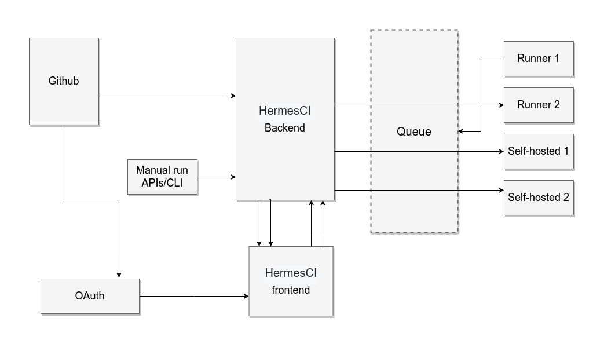

# Hermes CI

Hermes CI is an open-source continuous integration platform mainly written in Go.

## Name

Hermes is the winged herald and messenger of the Olympian gods. In addition, he is also a divine trickster, and the god of roads, flocks, commerce, and thieves. ... Hermes was the only Olympian capable of crossing the border between the living and the dead.

## Stability and Compatibility

> DO NOT USE IT IN PRODUCTION

> Status: The library is currently undergoing heavy development with frequent, breaking API changesç-.

## How it works



### Components

- Backend: a web server written in Go receive code hosting platforms webhooks and schedule the job
- Queue: a Message broker written in Go and uses Asynq library
- Runner: a cross-platform Queue consumer written in Go and can run anywhere with docker
- Frontend: a web application written in Vue.js/Typescript (Nuxt) allows users to configure Hermes and show jobs logs/status

### requirement

- MongoDB server: make sure you update `.env` files in both `backend` and `runner`

- Redis server (you can use dockernized version)

```sh
docker run --name my-redis -p 6379:6379 -d redis
```

- [Buildah](https://github.com/containers/buildah) : a tool that facilitates building Open Container Initiative (OCI) container images.

### Run dev

- **Backend**

Fill the ./backend/env.example and rename it to ./backend/.env

```sh
make -C ./backend dev
```

- **Runner**

Fill the ./runner/env.example and rename it to ./runner/.env

```sh
make -C ./runner dev
```

- **Client**

Fill the ./client/env.example and rename it to ./client/.env

```sh
make -C ./backend dev
```

### Repository configuration

Hermes is listing to Github webhooks and run the `Dockerfile` in your Repository for that you need to have:

- **Dockerfile**: put whatever you want on in it

```yaml
FROM yauritux/busybox-curl


RUN echo "Running build"
RUN echo "We don't need to build anything"


RUN echo "Getting Ouarzazate weather"
RUN echo "weather is goood"
```

- **Hermes.yaml**: a Hermes config file for now accepts only `name`, `version`, `schema` and for `schema` accepts only `docker` for now

```yaml
name: Build
version: 1.0.0
schema: docker
```
